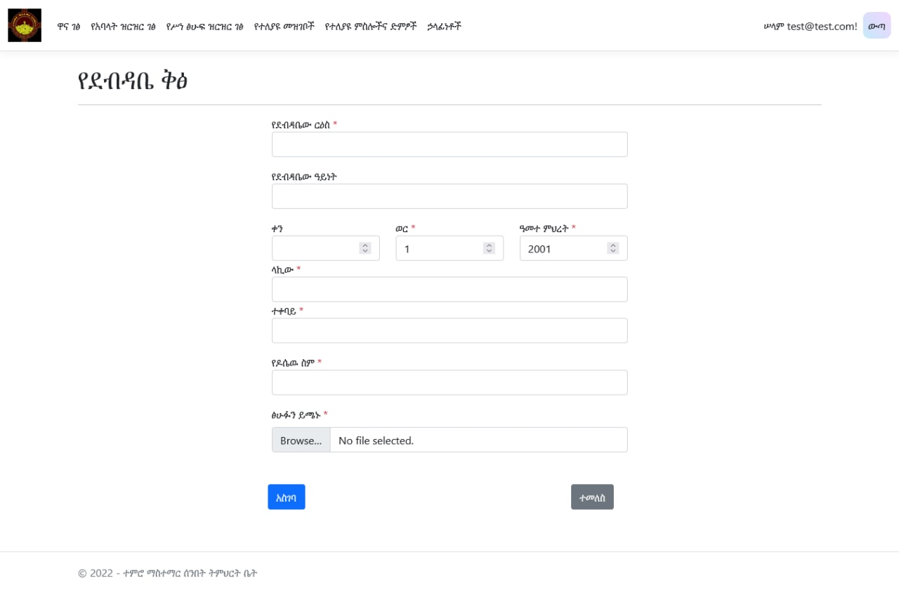
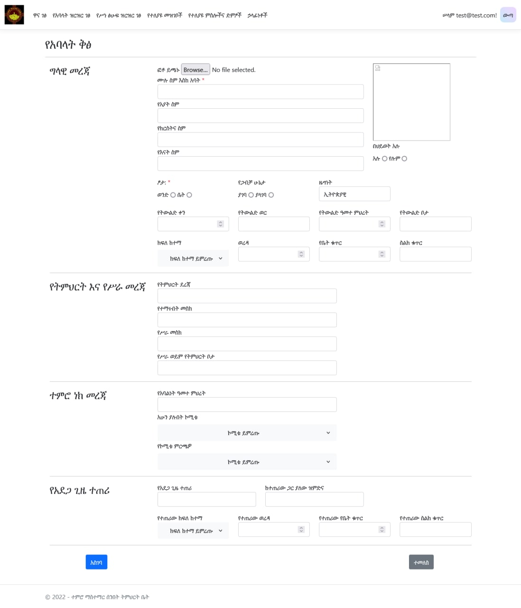
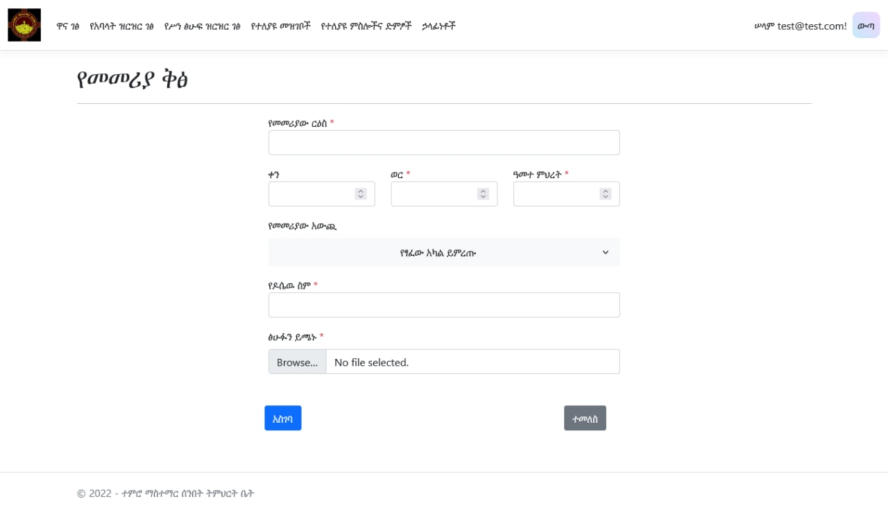

# Temro Mastemar - Registration and Store Managment System using .net 6 mvc

This is a solution to the **Registration and Store Managment System .net mvc**

## Table of contents

- [Overview](#overview)
  - [The challenge](#the-challenge)
  - [Screenshot](#screenshot)
- [My process](#my-process)
  - [Built with](#built-with)
- [Author](#author)

## Overview

### The challenge

Users should be able to:

- Register new members
- Add different Litretures
- Add different related files

Admin should be able to:

- Allow specific users to do certain tasks like **deleting**

### Screenshot

## My process

### Built with

- Semantic HTML5 markup
- CSS custom properties
- Flexbox
- CSS Grid
- Bootstrap 5
- J Query libraries

## Author

- Github - [@Ezmad-Ze](https://github.com/Ezmad-Ze)
